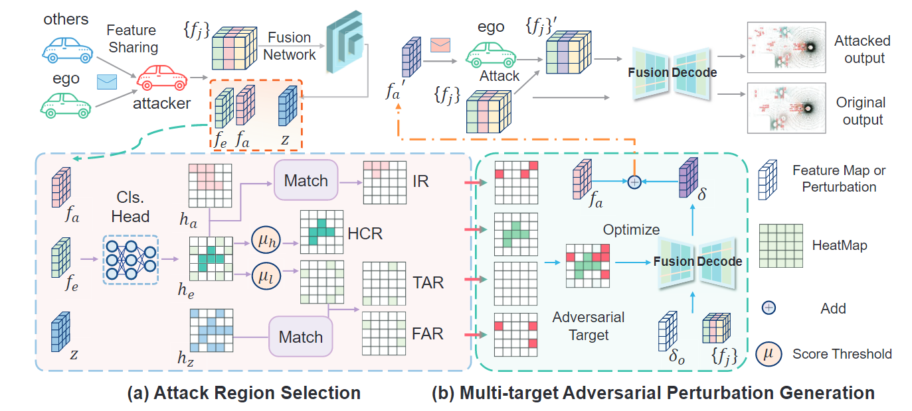
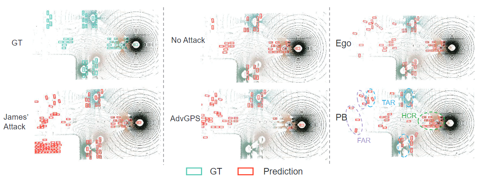

# ICCV 2025 - Pretend Benign

<div align="center">

# Pretend Benign: A Stealthy Adversarial Attack by Exploiting Vulnerabilities in Cooperative Perception

[](https://openaccess.thecvf.com/content/ICCV2025/html/Lin_Pretend_Benign_A_Stealthy_Adversarial_Attack_by_Exploiting_Vulnerabilities_in_ICCV_2025_paper.html)

<table>
  <tr>
    <td align="center" width="50%">
      
    </td>
    <td align="center" width="50%">
      
    </td>
  </tr>
</table>

</div>

## Introduction

This is the official repository for **ICCV 2025 - Pretend Benign**.

**Pretend Benign** proposes a stealthy adversarial attack for cooperative perception. Pretend Benign exploits vulnerabilities in cooperative perception systems and enables attackers to disguise themselves as benign cooperators while bypassing defense methods.

## Contents

- [Installation](#installation)
- [Getting Started](#getting-started)
- [Dataset Preparation](#dataset-preparation)
- [Training and Testing Cooperative Perception Models](#training-and-testing-cooperative-perception-models)
- [Adversarial Attacks](#adversarial-attacks)
- [Adversarial Defenses](#adversarial-defenses)
- [Configuration](#configuration)
- [Experiment Logs](#experiment-logs)
- [Citation](#citation)
- [Acknowledgements](#acknowledgements)

## Installation

This codebase is mainly based on [OpenCOOD](https://github.com/DerrickXuNu/OpenCOOD).

### 1. Clone the repository

```bash
git clone https://github.com/windlinsherlock/Pretend-Benign.git
cd Pretend-Benign
```

If you downloaded the source code directly, enter the repository root before running the following commands.

### 2. Create the conda environment

```bash
conda create --name pb python=3.8.13
conda activate pb

pip install torch==1.13.0+cu117 torchvision==0.14.0+cu117 torchaudio==0.13.0 --extra-index-url https://download.pytorch.org/whl/cu117
pip install spconv-cu117
```

### 3. Install project dependencies and build extensions

```bash
pip install -e .

python opencood/utils/setup.py build_ext --inplace

cd opencood/pcdet_utils
python setup.py build_ext --inplace
cd ../..
```

## Getting Started

Most training, inference, attack, and defense scripts are under [`opencood/tools/scripts`](opencood/tools/scripts). Run the following commands from [`opencood/tools`](opencood/tools) unless otherwise noted.

```bash
cd opencood/tools
```

The script wrappers write logs to [`logs`](logs). They run jobs with `nohup`, so the command returns after launching the process.

## Dataset Preparation

Please prepare the OPV2V and V2XSet datasets following their official instructions:

- [OPV2V data preparation](https://opencood.readthedocs.io/en/latest/md_files/config_tutorial.html)
- [V2XSet repository](https://github.com/DerrickXuNu/v2x-vit)

Expected dataset layout:

```text
data/
├── opv2v_data_dumping/
│   ├── test/
│   ├── test_culver_city/
│   ├── train/
│   └── validate/
└── V2XSet/
    ├── test/
    ├── train/
    └── validate/
```

## Training and Testing Cooperative Perception Models

### Training

Train with multiple GPUs:

```bash
bash scripts/detection/dis_train.sh ${NUM_GPUS} --hypes_yaml ${CONFIG_FILE}
```

Train with a single GPU:

```bash
bash scripts/detection/train.sh --hypes_yaml ${CONFIG_FILE}
```

Example:

```bash
CUDA_VISIBLE_DEVICES=0,1,2,3 bash scripts/detection/dis_train.sh 4 \
  --hypes_yaml ../../hypes_yaml/attack/opv2v/point_pillar/mean/detection/point_pillar_intermediate_mean.yaml
```

### Testing

Test multiple checkpoint epochs:

```bash
bash scripts/detection/inference.sh \
  --model_dir ${MODEL_SAVE_PATH} \
  --hypes_yaml ${CONFIG_FILE} \
  --start_epoch ${START_EPOCH} \
  --save_npy
```

Test a single checkpoint epoch:

```bash
bash scripts/detection/inference.sh \
  --model_dir ${MODEL_SAVE_PATH} \
  --hypes_yaml ${CONFIG_FILE} \
  --ckpt ${CKPT} \
  --save_npy
```

## Adversarial Attacks

### Generate attackers for each scenario

Randomly generate attackers for each scenario according to the configured attacker ratio:

```bash
bash scripts/attack/attackers_generate.sh ${CONFIG_FILE}
```

Example:

```bash
bash scripts/attack/attackers_generate.sh \
  ../../hypes_yaml/attack/opv2v/point_pillar/mean/attackers_generate/ratio_0.5/attackers_generate_ratio_0.5.yaml
```

### Generate adversarial perturbations

The attack effect after perturbation generation can be checked from the generated logs.

C&W and PGD:

```bash
bash scripts/attack/adv_generate.sh \
  --model_dir ${MODEL_SAVE_PATH} \
  --hypes_yaml ${CONFIG_FILE} \
  --ckpt ${CKPT} \
  --save_npy
```

James' Attack:

```bash
bash scripts/attack/James_attack.sh \
  --model_dir ${MODEL_SAVE_PATH} \
  --hypes_yaml ${CONFIG_FILE} \
  --ckpt ${CKPT} \
  --save_npy
```

PB, ours:

```bash
bash scripts/attack/PB_attack.sh \
  --model_dir ${MODEL_SAVE_PATH} \
  --hypes_yaml ${CONFIG_FILE} \
  --ckpt ${CKPT} \
  --save_npy
```

### Evaluate adversarial attacks

Use this command for ego-only testing, upper-bound testing with only benign collaborators, and evaluation under adversarial perturbations:

```bash
bash scripts/attack/adv_inference.sh \
  --model_dir ${MODEL_SAVE_PATH} \
  --hypes_yaml ${CONFIG_FILE} \
  --ckpt ${CKPT} \
  --save_npy
```

## Adversarial Defenses

RoboSAC defense:

```bash
bash scripts/defense/robosac.sh \
  --model_dir ${MODEL_SAVE_PATH} \
  --hypes_yaml ${CONFIG_FILE} \
  --ckpt ${CKPT} \
  --save_npy
```

FLD defense:

```bash
bash scripts/defense/FLD.sh \
  --model_dir ${MODEL_SAVE_PATH} \
  --hypes_yaml ${CONFIG_FILE} \
  --ckpt ${CKPT} \
  --save_npy
```

## Configuration

All configuration files for cooperative perception models, adversarial attacks, and defenses are stored in [`hypes_yaml`](hypes_yaml).

Useful entry points include:

- Detection configs: [`hypes_yaml/attack/opv2v/point_pillar/mean/detection`](hypes_yaml/attack/opv2v/point_pillar/mean/detection)
- Attack generation configs: [`hypes_yaml/attack/opv2v/point_pillar/mean/adv_generate`](hypes_yaml/attack/opv2v/point_pillar/mean/adv_generate)
- Attack inference configs: [`hypes_yaml/attack/opv2v/point_pillar/mean/adv_inference`](hypes_yaml/attack/opv2v/point_pillar/mean/adv_inference)
- Defense configs: [`hypes_yaml/attack/opv2v/point_pillar/mean/robosac`](hypes_yaml/attack/opv2v/point_pillar/mean/robosac), [`hypes_yaml/attack/opv2v/point_pillar/mean/FLD`](hypes_yaml/attack/opv2v/point_pillar/mean/FLD)

## Experiment Logs

Due to differences between this open-source version and the original experimental environment, such as CUDA versions and random seeds, the detection performance of cooperative perception models and the performance under different attacks and defenses may differ slightly from the original version.

The overall qualitative trends remain the same, and the stealthiness of Pretend Benign is consistent with the original version. Please use this open-source repository as the official version.

We provide experiment logs for both versions:

- Open-source version logs: [`logs`](logs)
- Original version logs: [`old_logs`](old_logs)

## Citation

If you use this project in your research, please cite the following paper:

```bibtex
@InProceedings{Lin_2025_ICCV,
  author    = {Lin, Hongwei and Pan, Dongyu and Xia, Qiming and Wu, Hai and Wang, Cheng and Shen, Siqi and Wen, Chenglu},
  title     = {Pretend Benign: A Stealthy Adversarial Attack by Exploiting Vulnerabilities in Cooperative Perception},
  booktitle = {Proceedings of the IEEE/CVF International Conference on Computer Vision (ICCV)},
  month     = {October},
  year      = {2025},
  pages     = {19947-19956}
}
```

## Acknowledgements

Thanks to the excellent cooperative perception codebase [OpenCOOD](https://github.com/DerrickXuNu/OpenCOOD).
